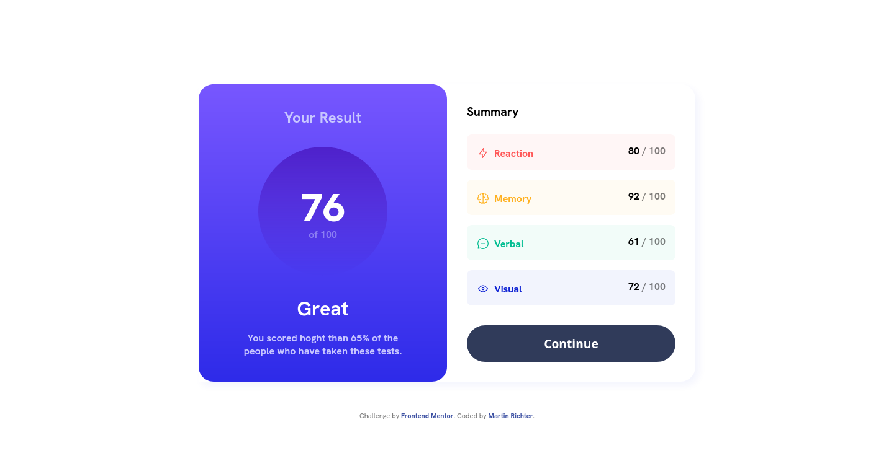
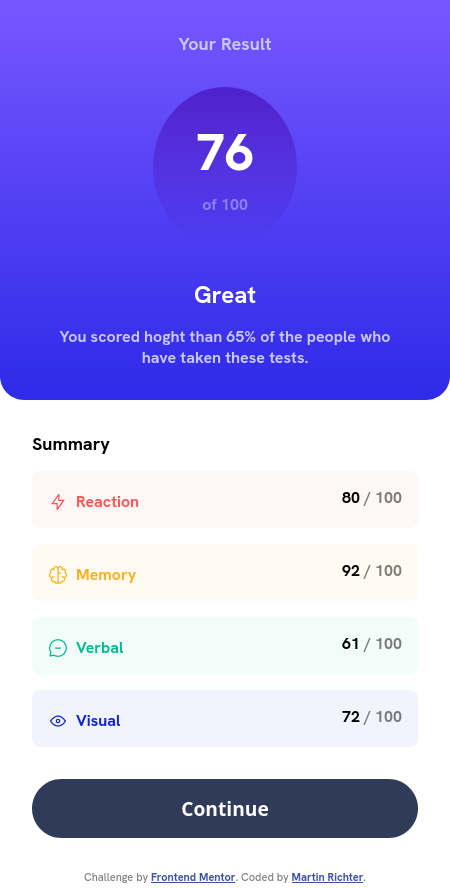
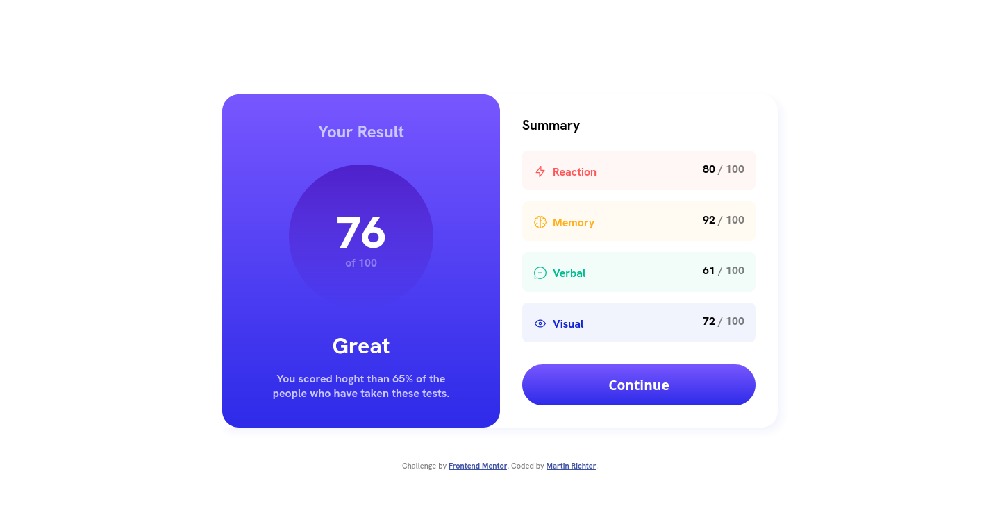

# Frontend Mentor - Results summary component solution

This is a solution to the [Results summary component challenge on Frontend Mentor](https://www.frontendmentor.io/challenges/results-summary-component-CE_K6s0maV). Frontend Mentor challenges help you improve your coding skills by building realistic projects.

## Table of contents

-   [Overview](#overview)
    -   [The challenge](#the-challenge)
    -   [Screenshot](#screenshot)
    -   [Links](#links)
-   [My process](#my-process)
    -   [Built with](#built-with)
    -   [What I learned](#what-i-learned)
    -   [Continued development](#continued-development)
-   [Author](#author)

**Note: Delete this note and update the table of contents based on what sections you keep.**

## Overview

### The challenge

Users should be able to:

-   View the optimal layout for the interface depending on their device's screen size
-   See hover and focus states for all interactive elements on the page

### Screenshot





### Links

-   Solution URL: [Frontend Mentor Solution Page](https://www.frontendmentor.io/solutions/age-calculator-app-9Eg--l5q8Q)
-   Live Site URL: [Live Application](https://results-summary-component-mr.netlify.app)

## My process

### Built with

-   Vite (https://vitejs.dev/)
-   ReactJS (https://react.dev)
-   Sass/Scss (https://sass-lang.com/)

### What I learned

I used React because i have not used React in a while and wanted to remind myself of the process of creating components and linking them together.

Also i learned a few little things in CSS / SCSS
like this dynamicly usable custom property for hsl color

```css
--hsl-light-red: 0, 100%, 67%;
--light-red: hsl(var(--hsl-light-red));
```

but also usable as hsla like:

```css
--opacity: 0.05;
background: hsla(var(--hsl-light-red), var(--opacity));
```

### Continued development

Using React for one of the next bigger projects, so i keep working with React and not only use Vue

## Author

-   Frontend Mentor - [@Karag2006](https://www.frontendmentor.io/profile/Karag2006)
-   GitHub - [Karag2006](https://github.com/Karag2006)
-   GitLab - [@martin.richter2006](https://gitlab.com/martin.richter2006)
-   Twitter - [@karag2006](https://www.twitter.com/karag2006)
-   Mastodon - [@karag@fosstodon.org](https://fosstodon.org/@karag)
